# Assignment 2 - DIP with PyTorch

### This is Yibo Zhao's implementation of DIP assignment 2.

## Requirements

To install requirements:

```setup
python -m pip install -r requirements.txt
```

## Running

To run Poisson Image Editing, run:

```blend
cd 2.1_PoissonImageBlending
python run_blending_gradio.py
```

To run Pix2Pix training, run:

```learning
cd 2.2_Pix2Pix
python download_facades_dataset.py
python train.py
```

## Results 
### Poisson Image Editing

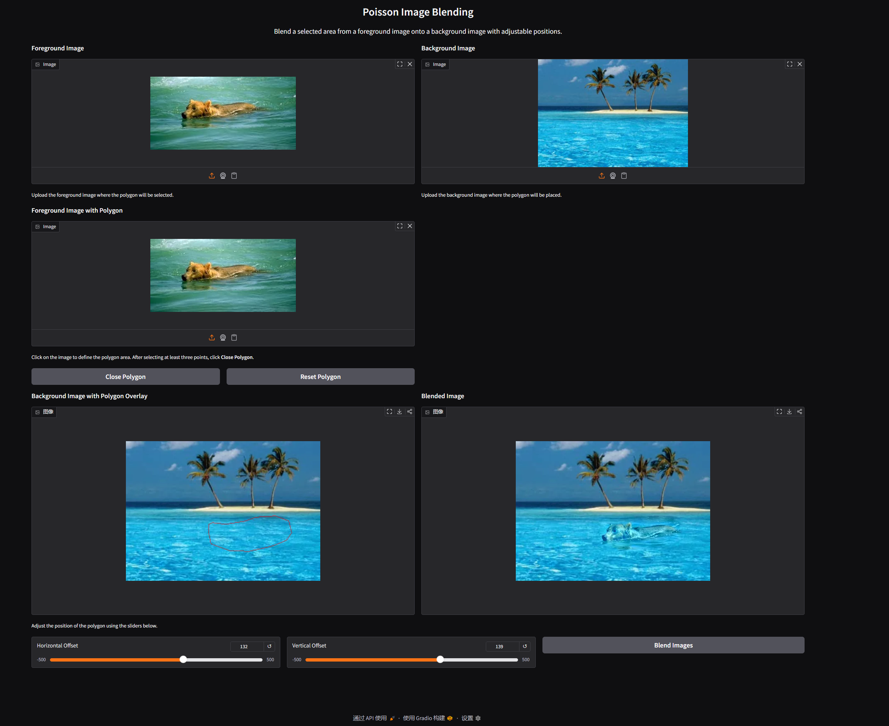
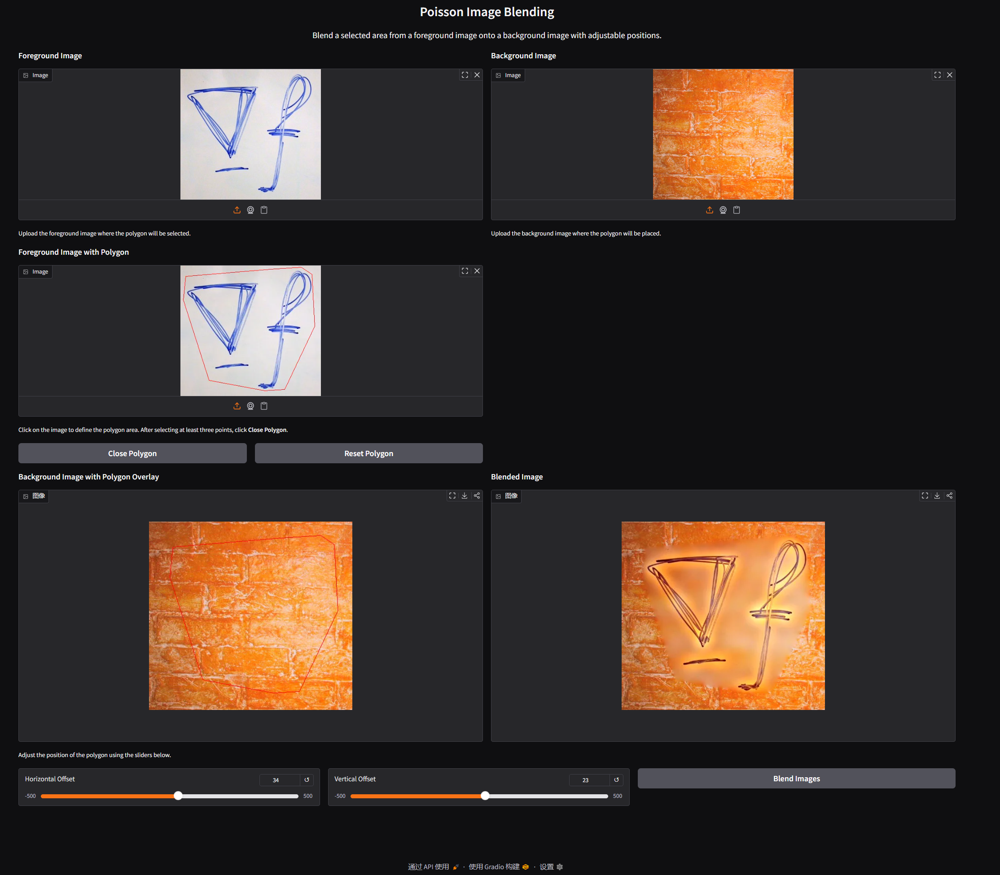


### Pix2Pix:
#### train_results

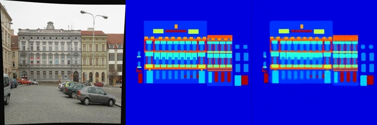
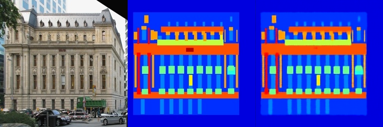
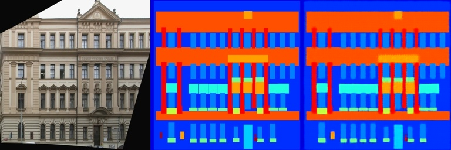
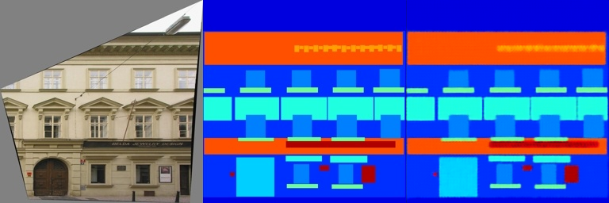
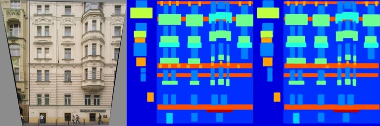

#### val_results
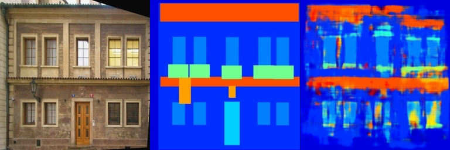
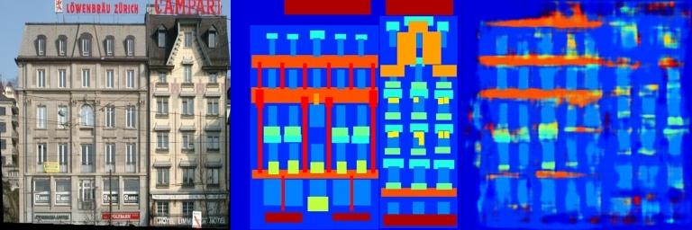
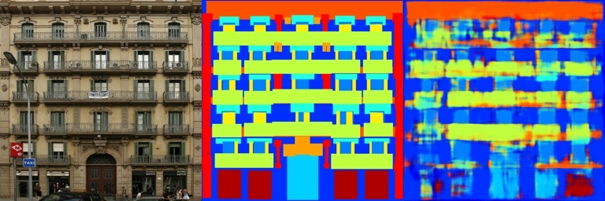
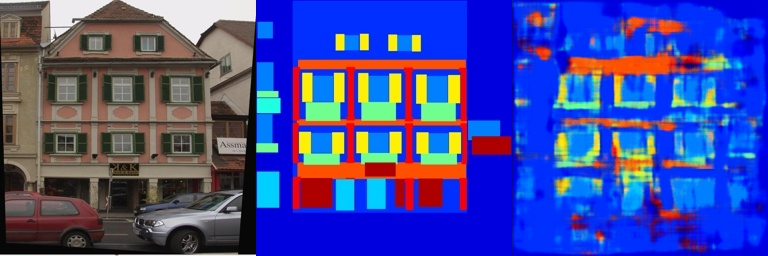
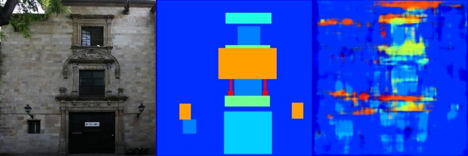

