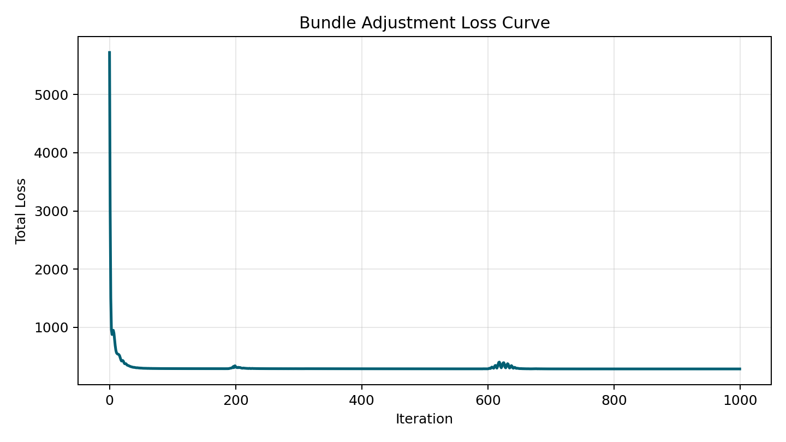
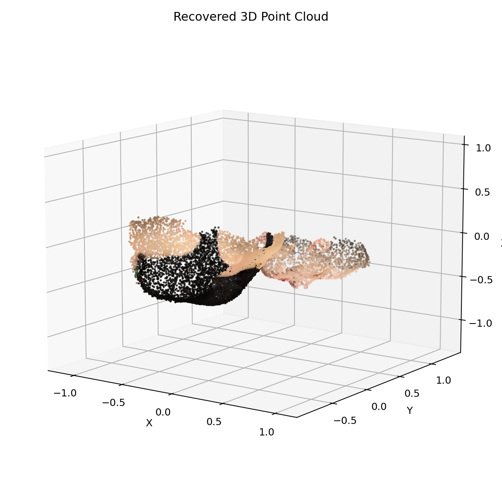
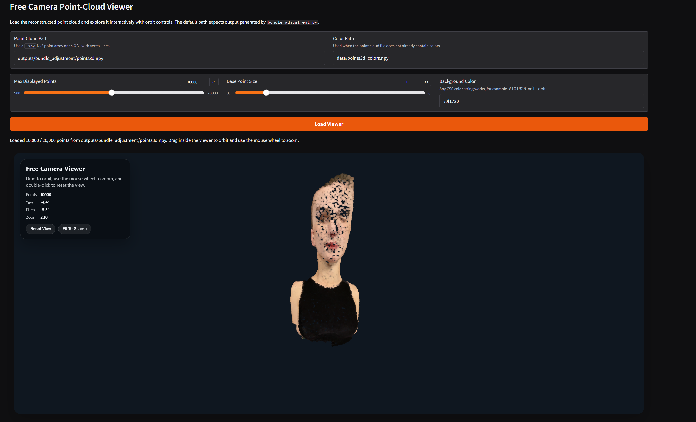
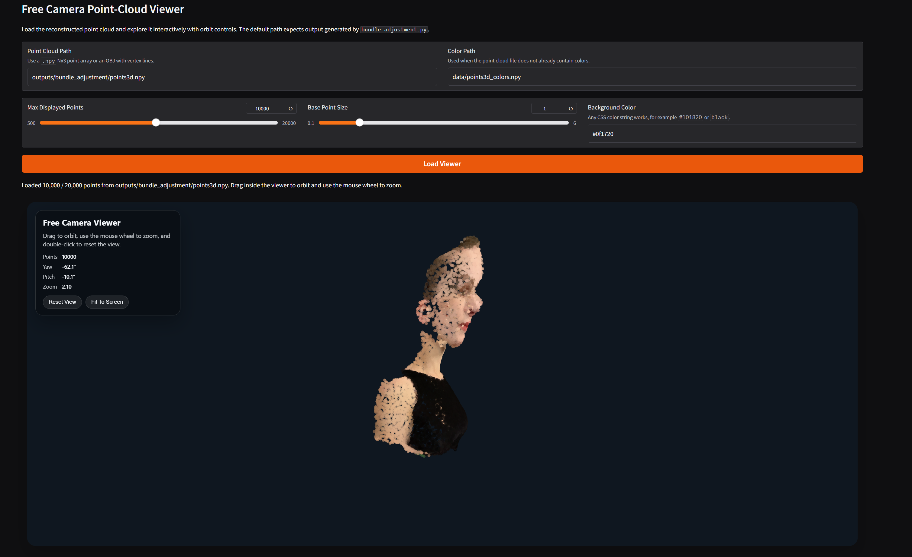
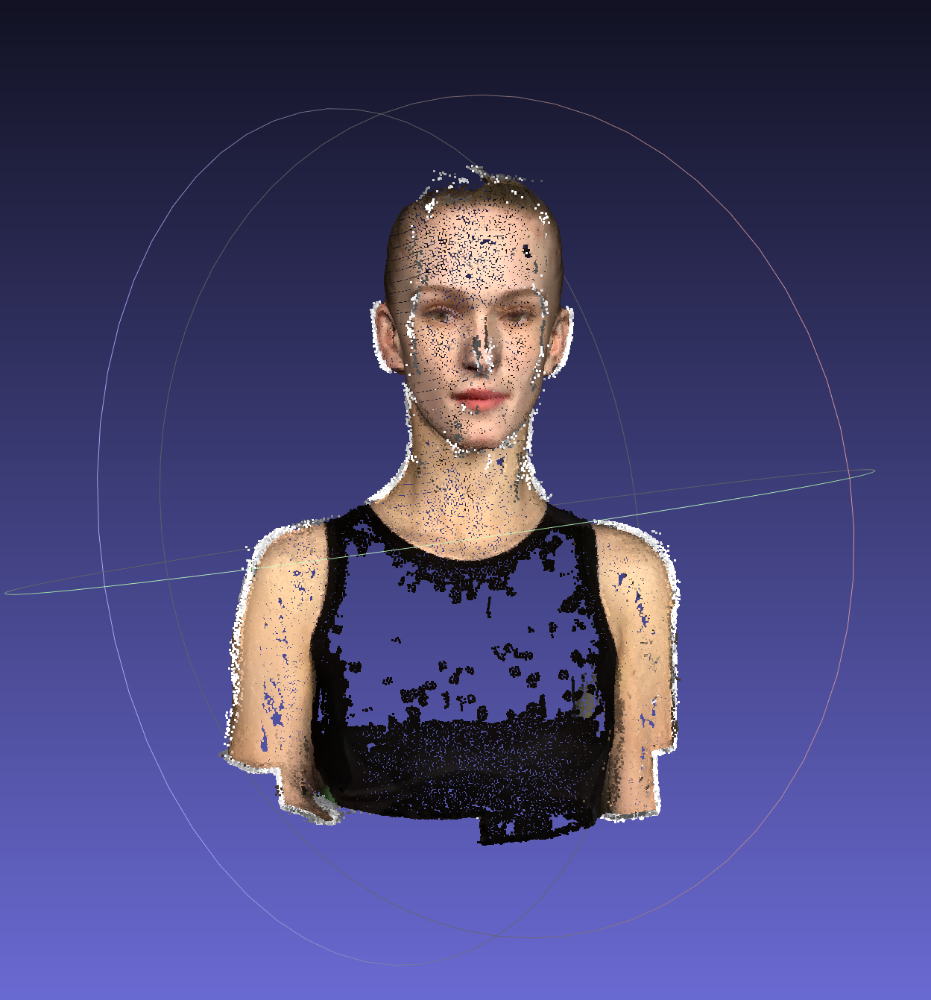

# Assignment 3 - Bundle Adjustment

### This is Yibo Zhao's implementation of DIP assignment 3.

## Requirements

To install requirements:

```setup
python -m pip install -r requirements.txt
```

## Running

To run Bundle Adjustment with PyTorch, run:

```
python bundle_adjustment.py
```

To run colmap, run:

```learning
python run_colmap.py
```

## Results 
### Bundle Adjustment with PyTorch

#### loss curve



#### point cloud





### Colmap:



